# ClauseGuard · 合同审批审查系统 — 架构图集

| 项 | 内容 |
|---|---|
| 文档编号 | CG-ARCH-001 |
| 版本 | **v1.1**（v1.0 = 2026-09-17 初稿） |
| 日期 | 2026-09-19 |
| 配套文档 | `SPEC.md`（CG-SPEC-001，规范契约）、`技术方案与设计.md`（CG-DESIGN-001，实现手段）、`验收对照表.md`（AC 证据索引） |
| 本版做了两件事 | ① **加入"给小白"的讲解层**（§0 起步、每图一句人话、名词词典）② **把图与代码对齐**（6 处 v1.0 与现实不符，逐条列在 §附录 C） |

---

## §0 先看这里（不需要任何背景知识）

### 0.1 这个系统在干什么（一句话）

> **把审批系统里"待处理"的合同，自动读一遍 → 按 11 条规则挑毛病 → 写一段审查意见 → 再贴回审批系统的评论区。人只需要点一下。**

它是**辅助工具**，不是决策者：最后拍板审批的仍然是人。系统只负责"把 200 页合同里那几处坑挖出来摆在你面前，并标注原文在哪一段"。

### 0.2 最简结构图（先只看这一张）

```
你（浏览器）
   │  ① 打开 http://127.0.0.1:5174
   ▼
┌───────────────────┐  /api/** 自动转发  ┌────────────────────┐
│ 调用端      :5174  │ ────────────────▶ │ 工具服务     :8000  │
│ Vue 页面 = 你看到的 │ ◀──────────────── │ FastAPI = 真正干活的 │
│ 界面               │      ② JSON        │                    │
└───────────────────┘                    └─────────┬──────────┘
                                                   │ ③
                    ┌──────────────────────────────┼──────────────────────────┐
                    ▼                              ▼                          ▼
        ┌────────────────────┐        ┌────────────────────┐      ┌──────────────────┐
        │ 模拟审批系统 :8100  │        │ MySQL        :3306  │      │ DeepSeek API      │
        │ 假装是公司 OA       │        │ 8 张表 = 唯一真相    │      │ 语义判定 + 摘要    │
        │ 只会收发数据        │        │                    │      │ （可选，可降级）   │
        └────────────────────┘        └────────────────────┘      └──────────────────┘
```

**记住这 4 个"零件"就够了**，后面所有图都是这张图的展开：

| 零件 | 端口 | 一句话 | 类比 |
|---|---|---|---|
| 调用端 | 5174 | Vue 3 页面，你眼睛看到的界面 | 公司的"操作台" |
| 工具服务 | 8000 | FastAPI，真正干活的程序 | 干活的"员工" |
| 模拟审批系统 | 8100 | 演示用的假 OA，提供待办/详情/附件/评论接口 | "别的部门"，只收发数据 |
| MySQL | 3306 | 数据库，8 张表 | 员工的"笔记本"，唯一真相 |

> 为什么我们不用规格里写的 5173？因为**端口是本机共享资源**，你另一个项目 InsightTrace 占了 5173。
> `scripts/dev_up.ps1` 会先校验"这个端口上的页面是不是本项目"（页面里必须出现 `ClauseGuard` 字样），
> 不是就顺延到 5174、5175…… —— 详见 §附录 C 第 3 条。

### 0.3 名词小词典（看到不懂的词回来查）

| 词 | 人话解释 | 本项目在哪用到 |
|---|---|---|
| **进程** | 一个正在运行的程序。两个进程 = 两份互不干扰的运行空间 | 工具服务和模拟审批系统是**两个**独立进程（`FR-SYS-01` 强制） |
| **端口** | 同一台电脑上区分"找哪个程序"的编号 | 8000 / 8100 / 5174 / 3306 |
| **代理（proxy）** | 中间转手：请求先给 A，A 替你转给 B 再拿回来 | Vite 把 `/api/**` 转给 8000，绕开浏览器跨域限制 |
| **跨域（CORS）** | 浏览器安全策略：A 站点的页面不许随便调 B 站点的接口 | 走代理就是为了**不给后端加 CORS** |
| **ORM** | 用 Python 对象操作数据库表，不用手写 SQL | SQLAlchemy 2.0（异步） |
| **异步（async）** | 等网络/磁盘的时候先去做别的事，不干等 | 全后端都是 `async def`；`asyncmy` 驱动 |
| **事务** | 一组"要么全成功要么全失败"的数据库操作 | 每步落库都包在 `session_scope()` 里 |
| **唯一索引** | 数据库层的"这列不许重复"硬约束 | `instance_id`、`task_id` 等共 **7 个**（FIG-11） |
| **幂等** | 同一个操作做 1 次和做 100 次，结果一样 | 重复拉取/审查/回写都不会产生重复数据 |
| **状态机** | 规定"状态只能怎么变"，非法变化直接报错 | `pending → parsing → reviewing → done / blocked`（FIG-07） |
| **降级** | 高级功能坏了，自动退到能用的低配方案，而不是整个崩掉 | LLM 挂了 → 关键词判定 + 模板摘要（`LM-18`） |
| **OCR** | 让计算机"看图认字"（扫描件、照片里的文字） | PaddleOCR，只在扫描页上用 |
| **证据子串** | 判断结果必须附上合同原文，且这段原文要能在全文里**一字不差地搜到** | 防止 AI 编造依据（`PS-10`） |

### 0.4 想自己动手验证？三条命令（不用会写代码）

```powershell
cd C:\Users\13273\Desktop\项目实战2\ClauseGuard

# ① 环境体检：23 项检查，缺什么、怎么补，一条命令给结论（只读，不改任何东西）
uv run --project backend python scripts/preflight.py

# ② 九步闭环演示：把每一步的判据逐条打印成 [OK]，比看文档直观
uv run --project backend python scripts/demo_closed_loop.py --instance AP-001

# ③ 拿一份任意合同走完整流程（借用一个待办槽位，跑完自动还原）
uv run --project backend python scripts/try_contract.py sample_contracts/extra/T-01_设备租赁合同.pdf
uv run --project backend python scripts/try_contract.py 你的合同.docx --instance AP-002
uv run --project backend python scripts/try_contract.py 你的合同.pdf --keep-slot   # 测完不还原槽位
```

一键起停（Windows）：

```powershell
powershell -ExecutionPolicy Bypass -File scripts/dev_up.ps1               # 起 MySQL + 8000 + 8100 + 前端
powershell -ExecutionPolicy Bypass -File scripts/dev_up.ps1 -NoFrontend   # 只起后端（不动前端）
powershell -ExecutionPolicy Bypass -File scripts/dev_status.ps1           # 看谁在跑、真实端口是多少
powershell -ExecutionPolicy Bypass -File scripts/dev_down.ps1             # 全停
```

### 0.5 怎么查看下面的 Mermaid 图

- **GitHub / GitLab / Gitee**：直接打开本文件，Mermaid 代码块**自动渲染成图**。
- **VS Code**：装 `Markdown Preview Mermaid Support` 插件，或 `Ctrl+Shift+V` 预览。
- **Typora**：默认开启，直接可见。
- **纯文本环境**：Mermaid 源码不可读 —— 因此关键图（FIG-01 / 02 / 04 / 08）额外附了 **ASCII 版本**，任何环境都能看。

> 图集编号 `FIG-01`…`FIG-14`，与 `SPEC.md` 的需求编号交叉引用。
> **本版新增 FIG-14（交付脚本与文档地图）**。

---

## FIG-01 系统总体架构（分层）

> 📖 **这张图在说什么**：把后端拆成三层 —— 门面（对外接口）→ 工具（干一件事的函数）→ 模块（业务逻辑）。
> 规矩是**依赖只能从上往下**，不能反过来，这样改一层不会牵连全盘。

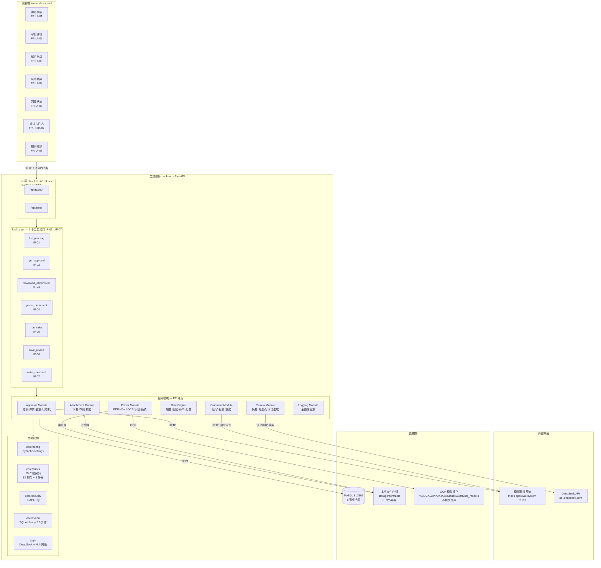

**关键约束（来自 SPEC）**

- `FR-SYS-01`：模拟审批系统**必须**是独立进程，工具服务只能通过 HTTP 访问它。
- `FR-SYS-02`：合同附件**禁止**对外暴露静态路由（前端只展示文件名/大小/校验值等元数据）。
- `FR-SYS-03`：调用端所有请求**必须**带 `X-API-Key`（在 router 上统一 `Depends`，等于"门口验票"）。
- `LM-18`：`E2` 不可用（无 Key / 超时 / 报错）时，系统**必须**仍能跑通全部 AC01–AC19 —— LLM 是增强项，不是单点依赖。

### FIG-01 ASCII 版

```
┌──────────────────────────────────────────────────────────────────────────┐
│ 调用端  Vue 3 + Element Plus  (5174；5173 被占时自动顺延)                  │
│ 待办列表 │ 审批详情 │ 解析结果 │ 风险结果 │ 回写状态 │ 重试/日志 │ 规则维护  │
└───────────────────────────────┬──────────────────────────────────────────┘
                                │ HTTP + X-API-Key（经 Vite 代理转发）
┌───────────────────────────────▼──────────────────────────────────────────┐
│ 工具服务  FastAPI  (8000)                                                 │
│                                                                          │
│ Tool Layer   ①拉取 ②详情 ③下载 ④解析 ⑤规则 ⑥存结果 ⑦回写评论             │
│ ──────────────────────────────────────────────────────────────────────── │
│ Approval   待办拉取 · 详情查询 · 任务去重 · 状态机                        │
│ Attachment 附件下载 · 文件存储 · SHA-256 校验                             │
│ Parser     PDF/Word/OCR · 16 字段提取 · 条款识别 · 证据定位               │
│ RuleEngine 规则加载 · 4 种库内模式 + 11 个专用处理器 · 命中保存 · 风险汇总 │
│ Review     风险汇总 · 中文摘要 · 审批关注点 · 评论文本                    │
│ Comment    评论生成 · 回写 · 回写日志 · 失败重试                          │
│ Logging    8 类核心操作日志                                              │
│ ──────────────────────────────────────────────────────────────────────── │
│ 基础设施  config(fail-fast) · errors(15 码) · security · db(异步) · llm   │
└──────┬──────────────────┬──────────────────┬─────────────────────────────┘
       │                  │                  │
       │ HTTP             │ ORM              │ OCR / 文件读写
┌──────▼──────────┐ ┌─────▼──────────┐ ┌─────▼───────────────────────────────┐
│ 模拟审批系统     │ │ MySQL 8        │ │ 本地存储                             │
│ (独立进程) :8100 │ │ 8 张业务表     │ │ 附件 storage/contracts（不公开）      │
│                 │ │                │ │ OCR 模型 %LOCALAPPDATA%\ClauseGuard\ │
└─────────────────┘ └────────────────┘ └─────────────────────────────────────┘
                              ▲
                              │ 语义规则判定 + 摘要生成（可降级）
                     ┌────────┴─────────┐
                     │ DeepSeek API     │
                     └──────────────────┘
```

---

## FIG-02 部署架构（进程 / 容器 / 端口）

> 📖 **这张图在说什么**：一台电脑上同时跑 4 个东西 —— 2 个 Python 进程、1 个 Node 进程、1 个 Docker 容器。
> "部署"问的就是：谁跑在哪、占哪个端口、文件写在哪。

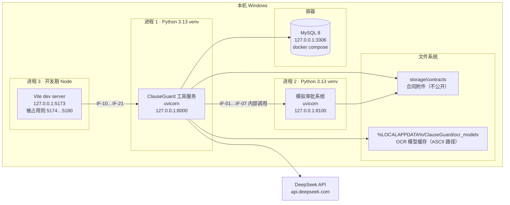

### FIG-02 ASCII 版

```
┌──────────────────────── 本机 Windows ────────────────────────────────┐
│                                                                      │
│  [进程1] 工具服务        127.0.0.1:8000   ← 真正干活的               │
│  [进程2] 模拟审批系统    127.0.0.1:8100   ← 假 OA                    │
│  [进程3] Vite dev server 127.0.0.1:5173→5174…  ← 界面               │
│  [容器]  MySQL 8         127.0.0.1:3306   ← 8 张表                   │
│                                                                      │
│  文件系统：                                                          │
│    <仓库>/storage/contracts/…             合同附件（禁止对外暴露）    │
│    %LOCALAPPDATA%\ClauseGuard\ocr_models   OCR 模型（不提交仓库）     │
└──────────────────────────────────────────────────────────────────────┘
```

**端口分配**

| 端口 | 服务 | 说明 |
|---|---|---|
| 8000 | 工具服务 | `APP_PORT`（CF-02）。**只绑 IPv4 127.0.0.1** |
| 8100 | 模拟审批系统 | `APPROVAL_BASE_URL`（CF-05） |
| 5173 → 5174…5180 | Vite 开发服务器 | 仅开发期；`strictPort` 下被占用会**自动顺延**并打印真实地址 |
| 3306 | MySQL 8 | Docker Compose（CF-04） |

> **两个必须知道的坑**（都是实测踩出来的，见 `错题本.md` B-* / D-4）：
> 1. **后端只绑 IPv4**。请一律用 `127.0.0.1:8000`，**不要**用 `localhost:8000` ——
>    在本机 `localhost` 可能被解析成 IPv6 `::1`，而那个端口上可能是 **Docker 的 relay 或另一个项目**的后端。
> 2. **端口 ≠ 身份**。判断"我的服务在不在跑"不能只看"端口返回 200"。
>    本项目所有探活（`dev_up.ps1` / `dev_status.ps1` / `preflight.py` / 浏览器用例）都必须**校验页面内容**。
>
> 工具服务与模拟审批系统**必须**分别启动（`FR-SYS-01`）。

---

## FIG-03 后端模块结构与依赖方向

> 📖 **这张图在说什么**：这是"代码文件夹之间的规矩"。
> 箭头 = "谁可以调用谁"。规矩是**只能从上往下调**，`logging/` 谁都能用但它不许反过来调业务模块（否则会绕成死循环）。

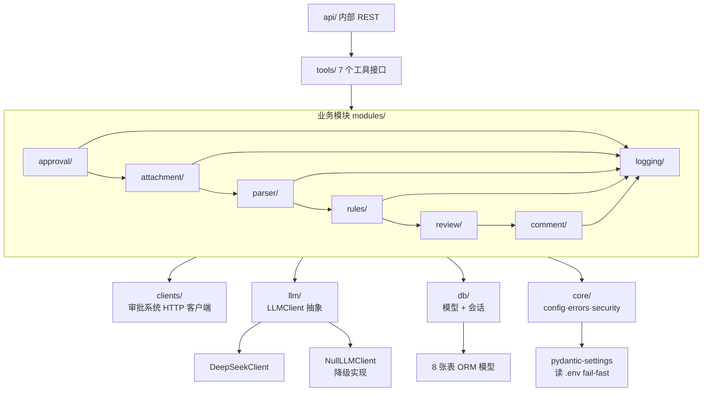

**依赖方向铁律**

- 依赖**只能**自上而下：`api → tools → modules → {clients, llm, db, core}`。
- `logging/` 被所有模块依赖，它**禁止**反向依赖任何业务模块（避免循环）。
- `llm/` 暴露抽象接口，业务模块**只依赖抽象** —— 这样换端点（DeepSeek → 其他 OpenAI 兼容）不改业务代码。
- 任何模块**禁止**绕过 `db/` 直接用驱动建连接（工程规范 §8）。

> 为什么小白容易在这里翻车：如果 `logging/` 里 import 了 `rules/`，而 `rules/` 又 import 了 `logging/`，
> Python 会在启动时报 `ImportError: cannot import name ... (most likely due to a circular import)`。
> 这条规矩就是提前防住它。

---

## FIG-04 端到端业务闭环（9 步 + 数据落点）

> 📖 **这张图在说什么**：整个项目的**主线剧情**。从"看到一条待办"到"审查意见贴回评论区"，一共 9 步。
> 虚线表示"这一步必须往哪张表写数据"——写库不是可选项，是规格强制要求。

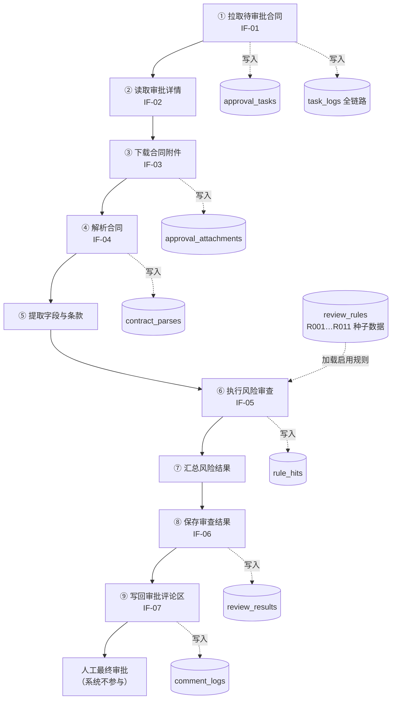

### FIG-04 ASCII 版

```
①拉待办 ──► ②查详情 ──► ③下附件 ──► ④解析 ──► ⑤提字段条款
                                                    │
   approval_tasks   approval_attachments   contract_parses
                                                    │
                                                    ▼
⑨回写评论 ◄── ⑧存结果 ◄── ⑦汇总风险 ◄── ⑥跑规则 ◄────┘
     │             │              │            ▲
     │             │              │            │
comment_logs  review_results  rule_hits   review_rules
     │                                        (R001…R011)
     ▼
人工最终审批（系统只给意见，不做决定）
```

**每一步的强制落点**

| 步骤 | 必须写入的表 | SPEC 依据 |
|---|---|---|
| ① | `approval_tasks` + `task_logs` | FR-APP-01/02、FR-LOG-01 |
| ③ | `approval_attachments` | FR-ATT-02 |
| ④ | `contract_parses`（失败也写 `parse_error`） | FR-PARSE-07 |
| ⑥ | `rule_hits` | FR-RULE-03/07 |
| ⑧ | `review_results` | FR-REV-05 |
| ⑨ | `comment_logs` | FR-COM-03 |

**每一步在代码里的落点**（小白对照用）

| 步骤 | 代码位置 | 备注 |
|---|---|---|
| ①② | `app/tools/approval.py` | HTTP 请求放在数据库事务**之外**（别把网络等待变成持锁时间） |
| ③ | `app/modules/attachment/service.py` | 落盘 + 算 SHA-256；文件名要消毒防路径穿越 |
| ④⑤ | `app/modules/parser/service.py` → `fields.py` | ④是"把纸读成字"，⑤是"从字里找信息"，**两件事** |
| ⑥ | `app/modules/rules/service.py` | 逐条跑规则；单条崩了只记 `uncertain`，不中断其他规则 |
| ⑦ | `app/modules/review/summarizer.py` | LLM 只允许生成摘要和关注点这两样文本 |
| ⑧ | `app/tools/review.py` | `UNIQUE(task_id)` 兜底，重复审查是更新不是新增 |
| ⑨ | `app/tools/comment.py` | 幂等键 `UNIQUE(idempotency_key)` |

> 注：实际实现中 ②（详情）与 ③（下载）由同一个入口 `POST /api/tasks/{id}/parse` 触发
> （`parse_task()` 内部先 `sync_approval_snapshot` 缓存表单，再 `ensure_attachments` 下载）。

---

## FIG-05 正常链路时序图

> 📖 **这张图在说什么**：把 FIG-04 的 9 步按**时间顺序**摊开，看清楚"谁先跟谁说话"。
> 竖线是各个角色，箭头是消息，从上往下读就是一次完整的自动审查。

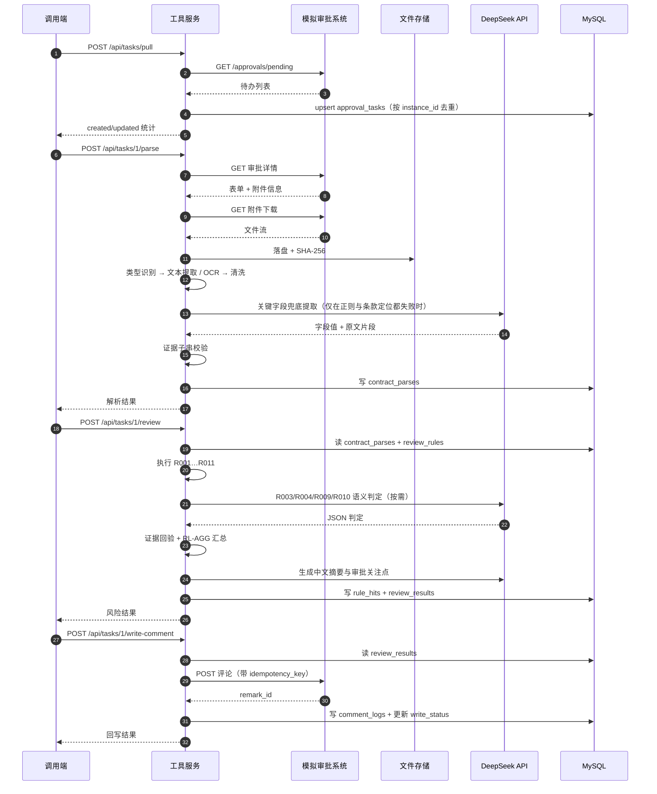

**要点**

- LLM 只在**两处**出现：语义规则判定、摘要/关注点生成 —— 图中已标注，其余全部确定性。
- 每次落库前都有一次**证据子串校验**（`PS-10`）：LLM 说"命中"但给不出能在原文里搜到的依据 → 降级为 `uncertain`，不写脏证据。
- 图中 `1` 是 `task_id`（数据库主键），不是审批单号；审批单号是 `instance_id`（如 `AP-001`）。

---

## FIG-06 异常与重试时序图（blocked 链路）

> 📖 **这张图在说什么**：出错时不装作成功，而是**停在原地并留下"病历"**：
> 卡在哪一步（`blocked_stage`）、什么原因（`error_code`）。人补好材料后点"重试"，从断点继续。

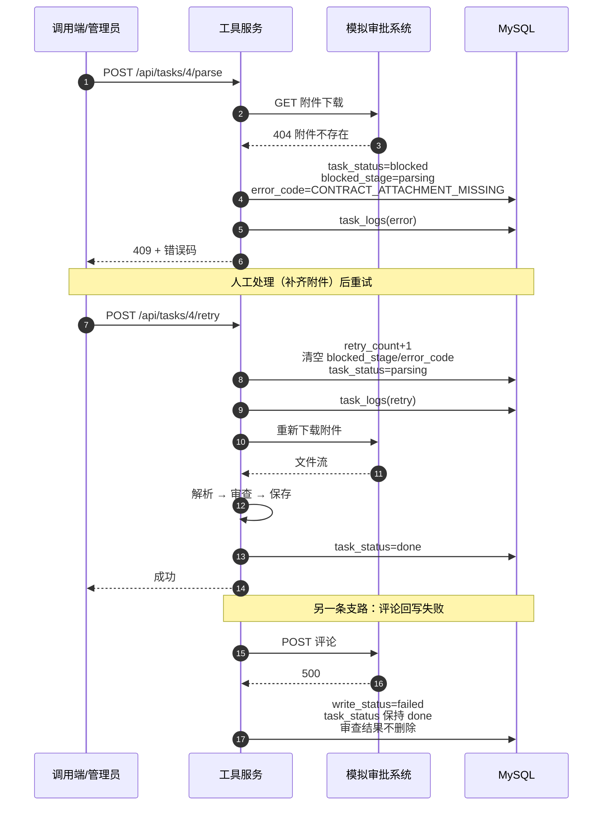

**两条关键规则**

- `ST-01-04` / `FR-COM-04`：**回写失败只改 `write_status`，任务保持 `done`，已产生的审查结果禁止删除**。
  理由：审查结果本身是有效成果，只是因为网络原因没送出去，重发即可 —— 不能因为"送信失败"就把写好的信撕掉。
- `ST-01-02`：重试**必须**清空 `blocked_stage` 与 `error_code` 并把 `retry_count` 加 1。
- 补充一条实现细节：任务已经是 `blocked` 时再次失败 → **不做非法迁移**，只刷新错误信息并记日志；
  任务已经 `done` 时出现异常 → **禁止改状态**，只记一条 `warning`（`fail_and_block()` 的三种分支）。

---

## FIG-07 状态机

> 📖 **这张图在说什么**：一个任务只有 5 种状态，而且**只能沿着箭头走**。
> 好处：任何"莫名其妙退回去"的 bug 会**当场报错**，而不是悄悄把数据搞坏。

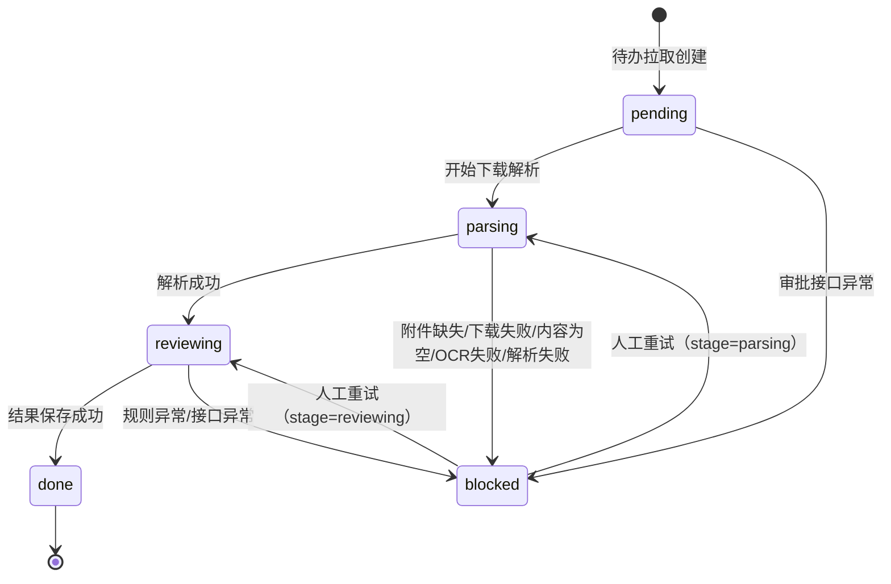

**回写状态机（`write_status`，独立于上面那个）**

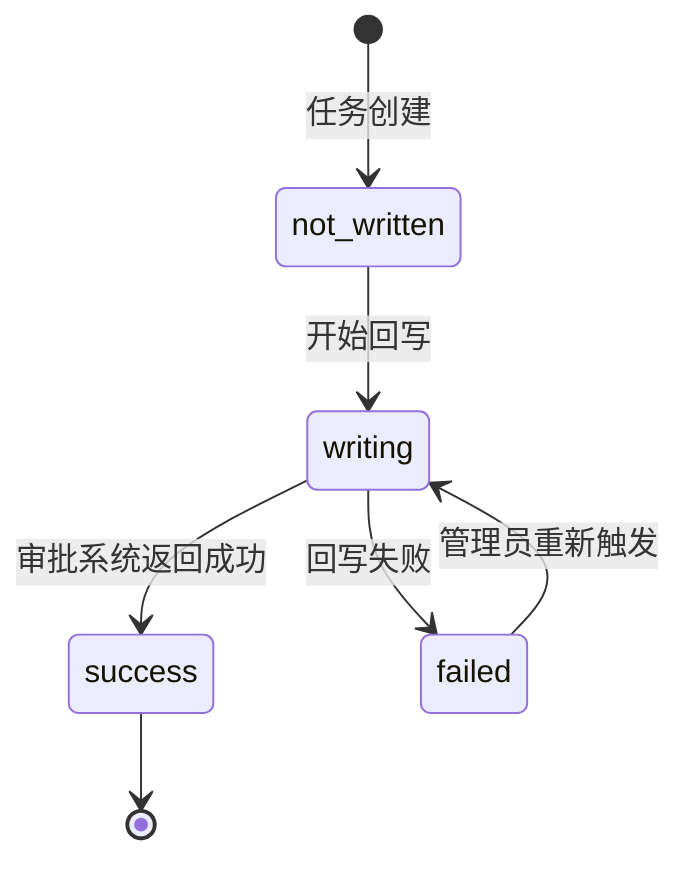

**非法迁移（实现必须拒绝）**

| 非法迁移 | 为什么禁止 | 依据 |
|---|---|---|
| `done → pending` | 重复拉取不能把已完成任务拉回起点 | `ST-01-03` |
| `blocked → done` | 必须经 `parsing`/`reviewing`，不能跳过 | `ST-01` |
| `success → writing` | 重复回写应返回既有结果并标 `duplicate=true` | `ST-02-01` |
| `pending → reviewing` | 没解析就没法审查 | `ST-01` |

**为什么必须有状态机**（小白最该带走的一条工程经验）

没有它，任何一段代码都能随手写 `task.task_status = "pending"`。等到界面出现怪现象时，
你无法判断是"哪个模块什么时候改的"。有了它，`transition_to()` 会检查"这次迁移在允许表里吗"，
不在就抛 `IllegalStateTransition` —— **把数据污染变成一次立刻可见的报错**。

> 实现位置：`app/modules/approval/state.py`。`LEGAL_TRANSITIONS` 就是这张图的代码版。

---

## FIG-08 数据模型 ER 图

> 📖 **这张图在说什么**：8 张表怎么互相认识。
> 中间那张 `approval_tasks` 是"主表"，其他 7 张都靠 `task_id` 挂到它下面 —— 找到任务，就能顺藤摸瓜找到它的附件、解析、命中、结果、评论、日志。

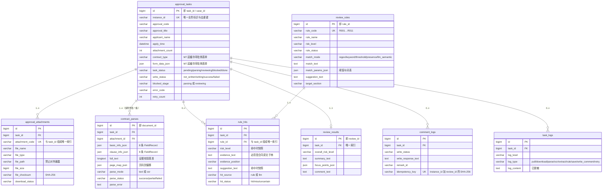

### FIG-08 ASCII 版

```
                        ┌──────────────────────┐
                        │   approval_tasks     │
                        │ id (PK) = task_id    │
                        │ instance_id  UNIQUE  │◄── 去重键
                        │ task_status          │
                        │ write_status         │
                        │ blocked_stage/error  │
                        └───────────┬──────────┘
        ┌───────────────┬───────────┼───────────┬───────────────┬────────────┐
        │ 1..n          │ 1..n      │ 0..n      │ 1..1          │ 0..n       │ 0..n
        ▼               ▼           ▼           ▼               ▼            ▼
┌───────────────┐ ┌───────────┐ ┌─────────┐ ┌──────────────┐ ┌──────────┐ ┌─────────┐
│approval_      │ │contract_  │ │rule_hits│ │review_results│ │comment_  │ │task_logs│
│attachments    │ │parses     │ │         │ │              │ │logs      │ │         │
│               │ │           │ │         │ │              │ │          │ │         │
│(task_id,      │ │(task_id,  │ │(task_id,│ │task_id UNIQUE│ │idempot-  │ │8 类日志 │
│ attach_code)  │ │ attach_id)│ │ rule_id)│ │              │ │ency_key  │ │         │
│  UNIQUE       │ │  UNIQUE   │ │ UNIQUE  │ │              │ │ UNIQUE   │ │         │
└───────────────┘ └───────────┘ └────┬────┘ └──────────────┘ └──────────┘ └─────────┘
                                     │ n..1
                                     ▼
                            ┌─────────────────┐
                            │  review_rules   │
                            │ rule_code UNIQUE│
                            │ R001 … R011     │
                            └─────────────────┘
```

**两张关系的口径说明**

- **`approval_tasks → contract_parses` 是 `1..n`，不是 `1..1`**（v1.0 图画错了）。
  原因：DT-03 的唯一约束是 `UNIQUE(task_id, attachment_id)` —— 一个任务可以挂多个附件，
  每个附件各产生一条解析记录，`1..n` 才能表达这个约束。
  这条口径在 `M0-验收记录.md` §5 就已提出并确认。
- **`approval_tasks → review_results` 才是真正的 `1..1`**：`UNIQUE(task_id)` 保证一个任务只有一份审查结果。

**唯一索引共 7 个**（不是 4 个也不是 6 个 —— v1.0 的图漏了 `review_rules.rule_code`），
分布见 FIG-11；实测查询见 §附录 C。

---

## FIG-09 解析流水线（PDF / Word / OCR 分流）

> 📖 **这张图在说什么**：一份合同文件怎么变成"能被程序搜索的纯文本"。
> 关键是**按页判断**：这一页抽不出字 → 认为它是扫描页 → 送去 OCR。

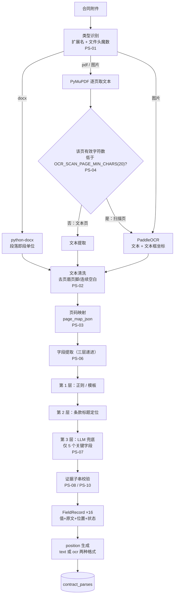

**分流规则**

- 混合文档（部分页扫描）→ `parse_mode` **必须**取 `ocr`（`PS-05`，从严），保证 `position` 格式唯一。
  实测 AP-003（纯扫描件）= `ocr`，其余样例 = `text`。
- LLM 兜底**只**作用于 `contract_amount`、`party_a`、`party_b`、`effective_date`、`expiry_date` 五个关键字段（`PS-07`）。
- 任何字段失败**不得**中断整体解析（`FR-PARSE-10`）；失败字段在界面上必须视觉区分（`FR-UI-03`）。

**两个 `position` 格式**（证据定位的坐标长相）

| `parse_mode` | `position` 形如 | 含义 |
|---|---|---|
| `text` | `第3页 第2段` | 第 3 页第 2 个段落 |
| `ocr` | `第1页 区域(120,340)` | 第 1 页、文本框左上角坐标 |

> 这就是为什么混合文档要从严取 `ocr`：同一份文件里不能一半是"段号"一半是"坐标"，否则前端和校验逻辑要写两套。

---

## FIG-10 规则引擎结构（11 规则 + 汇总）

> 📖 **这张图在说什么**：11 条规则怎么执行、怎么判断"命中"，以及**怎么防止 AI 乱说**。
> 核心机制：不管结论从哪来，都要附上能在原文里搜到的证据，搜不到就降级为"待人工确认"。

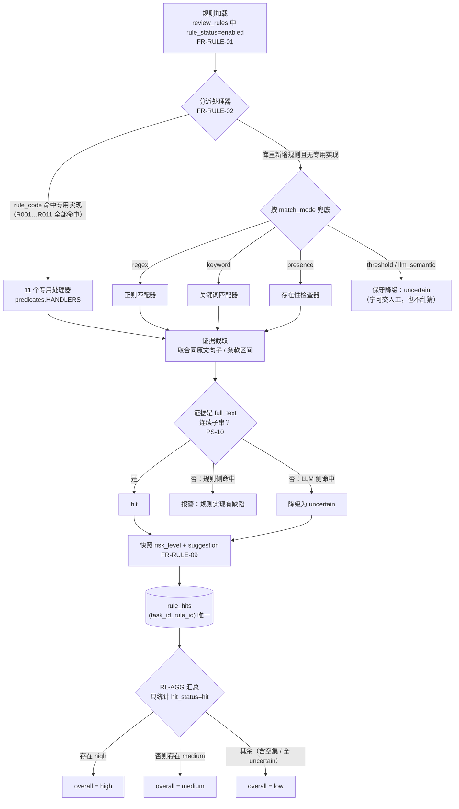

**库内实际 `match_mode` 分布**（实测查询，见 §附录 C）

| `match_mode` | 条数 | 规则 |
|---|---|---|
| `presence` | 6 | R004、R006、R007、R008、R010、R011 |
| `keyword` | 2 | R003、R009 |
| `threshold` | 2 | R001、R002 |
| `regex` | 1 | R005 |
| `llm_semantic` | **0** | —— 种子数据里没有规则用它 |
| **合计** | **11** | |

**哪些规则真的会调用 LLM**（实测代码路径，见 §附录 C）

| 规则 | 触发 LLM 的条件 | LLM 不可用时的规则侧兜底 |
|---|---|---|
| R003 自动续约 | 关键词未命中、且不属于"须双方书面确认"的排除写法 | 记 `uncertain`（降级，不猜） |
| R004 违约责任 | 存在违约条款，但责任是否对等需读懂语义 | 命中 `unequal_signals` 词表 → 仍可判 `hit`；否则 `uncertain` |
| R009 数据处理 | 存在"个人信息"关键词，但合规四要素是否齐备需读懂语义 | 走关键词/存在性判定 |
| R010 知识产权 | 存在知识产权相关表述，归属是否明确需读懂语义 | 走存在性判定 |

> **只有 4 条规则会用到 LLM**（v1.0 写的是 3 条，漏了 R009），其余 7 条完全确定。
> 这正是"规则为主、LLM 兜底"的落点：**能写死的绝不用模型，写不死的才交给模型，且都留了退路**。
>
> ⚠️ 一处容易误读的地方：`match_mode` 不是主要分派机制。11 条内置规则**全部按 `rule_code` 走手写处理器**；
> `match_mode` 只在"有人往数据库新增了规则、但还没写对应处理器"时作为兜底标签使用。
> 此时 `threshold` / `llm_semantic` 会**保守地返回 `uncertain`**（而不是猜一个结果）——
> 这是刻意的设计取舍，不是未完成的功能。

---

## FIG-11 幂等与唯一索引分布（防重复防线）

> 📖 **这张图在说什么**：手抖点两次按钮、网络超时重试，会不会产生两份数据？
> 答案：不会。靠的不是"代码里先查一下"，而是**数据库层的唯一索引**。

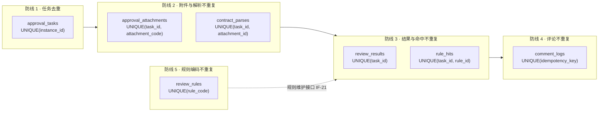

**为什么必须靠数据库约束**（`FR-APP-03`）

应用层"先查后插"在并发下会失效：两个请求**同时**查到"不存在"，然后**都**执行插入。
唯一索引是唯一可靠的防线 —— 应用层只负责捕获冲突并转成 upsert。

> 这不是纸上谈兵：本项目在 M7 加固轮由测试翻出**两处真实并发缺陷**
> （并发回写评论、并发创建同名规则，都是 `IntegrityError 1062` → 500），
> 修法就是"原子 upsert + 捕获 1062 转 422"。见 `docs/M7-验收记录.md` H-01 / H-03。

| 场景 | 防线 | SPEC |
|---|---|---|
| 重复拉取同一审批单 | `UNIQUE(instance_id)` | `FR-APP-02/03` |
| 重复下载同一附件 | `UNIQUE(task_id, attachment_code)` | `FR-ATT-06` |
| 重复解析同一附件 | `UNIQUE(task_id, attachment_id)` | `FR-PARSE-09` |
| 重复执行审查 | `UNIQUE(task_id, rule_id)` | `FR-RULE-07` |
| 重复保存结果 | `UNIQUE(task_id)` | `FR-REV-05` |
| 重复回写评论 | `UNIQUE(idempotency_key)` | `FR-COM-02` |
| 重复创建同名规则 | `UNIQUE(rule_code)` | SPEC §6 DT-04（⭐UNIQUE）/ IF-21 |

---

## FIG-12 前端结构与接口映射

> 📖 **这张图在说什么**：每个页面点下去，后端哪个接口会被叫到。
> 对照这张图，你可以在浏览器按 F12 的 Network 面板里一条条看到实际请求。

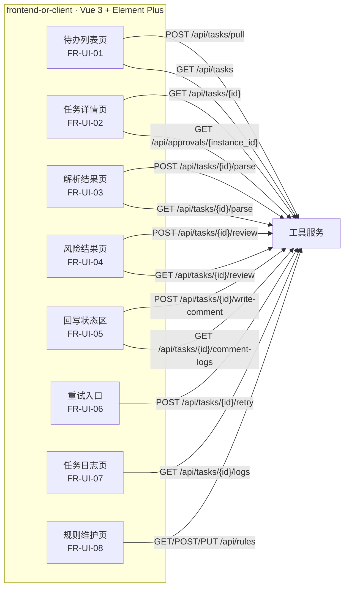

**页面文件 ←→ 接口 对照（小白按图找代码）**

| 界面 | Vue 文件 | 主要接口 |
|---|---|---|
| 待办列表 | `src/views/TaskListView.vue` | `POST /api/tasks/pull`、`GET /api/tasks` |
| 审批详情 | `src/views/TaskDetailView.vue` | `GET /api/tasks/{id}`、`GET /api/approvals/{instance_id}` |
| 解析结果 | `src/views/ParseResultView.vue` | `POST`/`GET /api/tasks/{id}/parse` |
| 规则命中 | `src/views/ReviewHitsView.vue` | `POST`/`GET /api/tasks/{id}/review` |
| 结果与回写 | `src/views/ResultHandleView.vue` | `POST /api/tasks/{id}/write-comment`、`GET .../comment-logs` |
| 任务日志 | `src/views/TaskLogsView.vue` | `GET /api/tasks/{id}/logs` |
| 规则维护 | `src/views/RulesView.vue` | `GET/POST/PUT /api/rules` |

> **接口统一封装**：所有请求都走 `src/api/client.ts` 的 `request()`，
> 它负责三件事：带 `X-API-Key`、解包统一错误结构、把失败抛成 `ApiError`。页面层不需要各自判断状态码。

**展示要点（验收时看这些）**

- 风险等级三色区分（`NF-10`）：`high` 红、`medium` 橙、`low` 绿。
- 解析结果的 `missing` / `failed` 字段**必须**视觉区分（`FR-UI-03`）—— 一眼能看出哪个字段没提到。
- 每个风险项**必须**同时显示证据原文与位置 —— 这是 PRD "可解释性"原则的界面体现。
- 窄屏（1024 / 800）不横向溢出、侧栏折叠（M7 加固轮 H-16）。

---

## FIG-13 里程碑依赖关系（**全部已完成**）

> 📖 **这张图在说什么**：这个大项目被拆成 M0…M7 八个阶段，一个阶段做完才做下一个。
> 现在这张图的作用已经从"计划"变成"复习"：想看某块功能，按里程碑找对应文档。

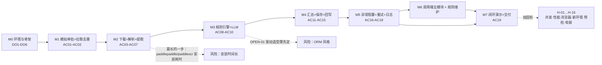

**状态：M0–M7 全部完成，AC01–AC19 全部有自动化证据**

| 里程碑 | 验收文档 | 结果 |
|---|---|---|
| M0 环境与骨架 | `M0-验收记录.md` | ✅ |
| M1 拉取与去重 | `M1-验收记录.md` | ✅ |
| M2 下载·解析·提取 | `M2-验收记录.md` | ✅ |
| M3 规则引擎与 LLM | `M3-验收记录.md` | ✅ |
| M4 汇总·保存·回写 | `M4-验收记录.md` | ✅ |
| M5 异常·重试·日志 | `M5-验收记录.md` | ✅ |
| M6 调用端与规则维护 | `M6-验收记录.md` | ✅ |
| M7 闭环·加固·交付 | `M7-验收记录.md` | ✅ 全量 **302 passed** |

**SPEC 里 5 个 OPEN（待定项）的最终结论**

| 编号 | 待定内容 | 结论 | 落在哪 |
|---|---|---|---|
| OPEN-01 | MySQL 异步驱动选型 | 选定 **`asyncmy`**（3.13 有轮子），同步侧用 `pymysql` | CF-03、`M0-验收记录` |
| OPEN-02 | 提取字段正则词表 | 已迭代固化，含"合并标题归一字段"修复 | `parser/fields.py`、`M7-验收记录` §7.11 |
| OPEN-03 | RL-009 四要素判定粒度 | 已用样例固化（缺"删除义务"即命中） | `database/seed_rules.sql` |
| OPEN-04 | 扫描页判定阈值 | 定为 **20 字符**（`OCR_SCAN_PAGE_MIN_CHARS`） | `.env` |
| OPEN-05 | 提交文件夹命名 | **按用户决定不做**（本项目不采用该交付形式） | —— |

**依赖说明**

- `M2` 是**最长的一步**：要装 paddlepaddle + paddleocr（体积大），还要调优扫描页判定阈值与字段词表。
- `M6` 调用端**只依赖 `M5` 的接口**，因此后端接口稳定后可与 `M5` 部分并行。
- `OPEN-01`（`asyncmy` vs 同步 `pymysql`）**必须在 M0 定**，否则 `M1` 的 ORM 代码要返工。

---

## FIG-14 交付脚本与文档地图（本版新增）

> 📖 **这张图在说什么**：项目除了"能跑"，还配了一套**自检工具**。
> 想知道"现在是什么状态、缺什么、怎么复现"，先看这一张。

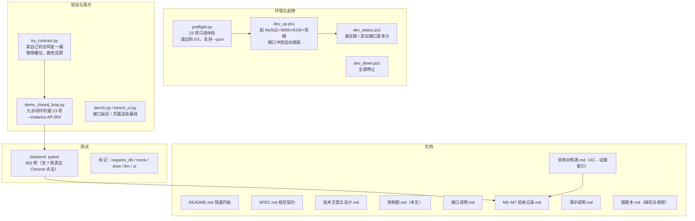

**文档阅读顺序建议（小白版）**

```
README.md（先跑起来）
   → 演示说明.md（照着走一遍演示）
   → 架构图.md（本文：搞清结构）
   → 接口说明.md（要看具体字段时查）
   → SPEC.md（要抠"为什么这么定"时查，5 万字，别通读）
   → 错题本.md（避开已经踩过的坑）
```

---

## 附录 A：图集与文档索引

| 图 | 主题 | 主要依据 |
|---|---|---|
| FIG-01 | 系统总体架构 | 设计文档 §3、SPEC §4 |
| FIG-02 | 部署架构 | 设计文档 §3.3、SPEC §3 |
| FIG-03 | 后端模块结构 | SPEC §4、工程规范 §3 |
| FIG-04 | 端到端闭环 | PRD §6、SPEC §4 |
| FIG-05 | 正常链路时序 | SPEC §4、§5 |
| FIG-06 | 异常与重试时序 | SPEC §5.4、§7 |
| FIG-07 | 状态机 | SPEC §7（ST-01/ST-02） |
| FIG-08 | 数据模型 ER | SPEC §6（DT-01…DT-08） |
| FIG-09 | 解析流水线 | SPEC §9（PS-01…PS-11） |
| FIG-10 | 规则引擎结构 | SPEC §8（RL-001…RL-AGG） |
| FIG-11 | 幂等与唯一约束 | SPEC §6、§12（NF-02/03） |
| FIG-12 | 前端结构与接口 | SPEC §5.2、§4.8 |
| FIG-13 | 里程碑依赖 | 设计文档 §14、SPEC §13 |
| **FIG-14** | **交付脚本与文档地图** | 本轮新增（M7 加固轮交付物） |

---

## 附录 B：术语与规格编号速查

**需求编号前缀**（看到 `FR-UI-03` 这种编号时来查）

| 前缀 | 含义 |
|---|---|
| `FR-*` | 功能需求（Functional Requirement），如 `FR-PARSE-07` |
| `IF-*` | 接口（Interface），如 `IF-10` 是拉取待办 |
| `DT-*` | 数据表（Data Table），`DT-01`…`DT-08` |
| `ST-*` | 状态机规则（State），如 `ST-01-03` |
| `RL-*` | 规则（Rule），`RL-001`…`RL-011` + `RL-AGG` 汇总 |
| `PS-*` | 解析规格（Parsing Spec），如 `PS-10` 证据子串校验 |
| `LM-*` | LLM 相关约定，如 `LM-18` 降级不影响主流程 |
| `CF-*` | 配置项（Config），如 `CF-02` 是端口 |
| `NF-*` | 非功能需求，如 `NF-06` 密钥不得泄漏 |
| `AC-*` | 验收标准（Acceptance Criteria），`AC01`…`AC19` |
| `TS-*` | 测试场景，`TS-01`…`TS-20` |
| `H-*` | M7 加固轮追加验证项，`H-01`…`H-16` |

**5 个任务状态 / 4 个回写状态**

| `task_status` | 人话 | `write_status` | 人话 |
|---|---|---|---|
| `pending` | 已拉到，还没动 | `not_written` | 还没回写 |
| `parsing` | 正在下载解析 | `writing` | 正在回写 |
| `reviewing` | 正在跑规则审查 | `success` | 回写成功 |
| `done` | 全流程完成（终态） | `failed` | 回写失败（任务仍保持 `done`） |
| `blocked` | 卡住了，等人处理 | | |

---

## 附录 C：v1.0 → v1.1 对齐核查（7 处修正 + 证据）

本版把图与代码逐项核对，发现并修正了 7 处 v1.0 与现实不符的地方。
**核查方式都是只读查询，命令与结果如下**。

| # | v1.0 写的 | 实际 | 证据 |
|---|---|---|---|
| 1 | `core/errors 12 个错误码` | **15 个** = 12 规范码 + 3 补充码（`VALIDATION_ERROR`/`INTERNAL_ERROR`/`RULE_NOT_FOUND`） | `app/core/errors.py` 的 `ErrorCode` 枚举共 15 个成员（前 2 个补充码见 M0-验收记录 §5，第 3 个见 M6） |
| 2 | OCR 模型缓存在 `storage/ocr_models` | **`%LOCALAPPDATA%\ClauseGuard\ocr_models`**（ASCII 路径，避免中文路径导致 Paddle 加载失败） | `settings.ocr_cache_dir` = `C:\Users\13273\AppData\Local\ClauseGuard\ocr_models`（CF-21 的**必要偏离**，见 M2-验收记录 R-01） |
| 3 | 调用端固定 `5173` | **5173 → 被占用时顺延 5174…5180**，且必须校验页面身份（含 `ClauseGuard` 字样）；本机当前为 **5174** | `vite.config.ts` `strictPort` + `dev_up.ps1` 身份校验；`错题本.md` D-4 |
| 4 | 唯一索引"4 个"（FIG-08 ASCII）/ 列 6 个（FIG-11） | **7 个**，漏了 `review_rules.uk_review_rules_rule_code` | `information_schema.STATISTICS`（`NON_UNIQUE=0`）实测 7 行 |
| 5 | "只有 3 条规则会用到 LLM（R003/R004/R010）" | **4 条**：R003、R004、**R009**、R010 | `predicates.py` 中调用 `_llm_hit` 的分支：`rule_auto_renewal`/`rule_breach_liability`/`rule_data_processing`/`rule_intellectual_property` |
| 6 | FIG-10 把 `match_mode` 当成主要分派机制，并声称含 `presence + llm_semantic` 等组合模式 | 11 条内置规则**全部按 `rule_code` 走专用处理器**；库内 `match_mode` 实际只有 4 种取值（presence 6 / keyword 2 / threshold 2 / regex 1），**没有任何规则使用 `llm_semantic`** | `predicates.py::resolve_handler` + `review_rules` 表实测分布 |
| 7 | FIG-08 把 `approval_tasks → contract_parses` 画成 `1..1` | **`1..n`**：一个任务可挂多个附件，各产生一条解析记录（`UNIQUE(task_id, attachment_id)`） | DT-03 约束；口径在 `M0-验收记录.md` §5 已确认 |

**核查输出（节选，实际执行）**

```
== 路径类配置 ==
STORAGE_DIR(附件)      = ...\ClauseGuard\storage\contracts
OCR_MODEL_DIR(模型缓存) = C:\Users\13273\AppData\Local\ClauseGuard\ocr_models
OCR_SCAN_PAGE_MIN_CHARS = 20

== 唯一索引（NON_UNIQUE=0，排除 PRIMARY）==
  approval_attachments   uk_approval_attachments_task_attachment (task_id,attachment_code)
  approval_tasks         uk_approval_tasks_instance_id           (instance_id)
  comment_logs           uk_comment_logs_idempotency_key         (idempotency_key)
  contract_parses        uk_contract_parses_task_attachment      (task_id,attachment_id)
  review_results         uk_review_results_task_id               (task_id)
  review_rules           uk_review_rules_rule_code               (rule_code)
  rule_hits              uk_rule_hits_task_rule                  (task_id,rule_id)
  合计 7 个唯一索引

== 启用规则与其 match_mode ==
  keyword      2 条：R003(medium/enabled)、R009(medium/enabled)
  presence     6 条：R004(high/enabled)、R006(high/enabled)、R007(high/enabled)、
                     R008(medium/enabled)、R010(high/enabled)、R011(high/enabled)
  regex        1 条：R005(medium/enabled)
  threshold    2 条：R001(high/enabled)、R002(medium/enabled)
```

**8 张表实测行数**（对应本机当前演示数据：9 条待办 = 7 条 `done` + 2 条 `blocked`）

| 表 | 行数 | 说明 |
|---|---|---|
| `approval_tasks` | 9 | AP-001…AP-009 |
| `approval_attachments` | 8 | AP-004 故意缺附件 |
| `contract_parses` | 8 | 每条已解析任务的解析记录 |
| `review_rules` | 11 | R001…R011 |
| `rule_hits` | 77 | 7 条 done × 11 条规则 |
| `review_results` | 7 | 一任务一条 |
| `comment_logs` | 7 | 7 条回写成功 |
| `task_logs` | 663 | 全链路日志 |

> **本表会随演示进度变化**，它记录的是本文撰写时的状态，不是恒定值。

---

## 附录 D：文档维护约定

1. **改架构图之前先跑一遍 §附录 C 的核查**：
   路径类配置、唯一索引、规则分布这三项最容易与代码脱节。
2. **"图中出现"就必须"代码里能指出来"**：每张图下方都标了依据（SPEC 章节 / 文件路径），
   新增图或结论时一并补上，否则下次没人能验证它是否还成立。
3. **不要只看状态码判断服务身份**（`错题本.md` D-4）：文档里凡出现"确认服务在跑"的步骤，
   都要写明**校验内容**，而不只是端口。
4. **数字必须单一来源**（`错题本.md` D-5）：图里的"11 条规则""302 例测试""7 个唯一索引"
   都应与代码/数据库实测一致；改一处要 grep 全仓同步。
