# ClauseGuard · 合同审批审查系统 — 架构图集

| 项 | 内容 |
|---|---|
| 文档编号 | CG-ARCH-001 |
| 版本 | v1.0 |
| 配套文档 | `SPEC.md`（CG-SPEC-001，规范契约）、`技术方案与设计.md`（CG-DESIGN-001，实现手段） |
| 日期 | 2026-09-17 |

## 怎么查看这些图

- **Gitee / GitHub / GitLab**：直接打开本文件，Mermaid 代码块会**自动渲染成图**。
- **Typora**：默认开启 Mermaid 渲染，直接可见。
- **VS Code**：装 `Markdown Preview Mermaid Support` 插件，或 `Ctrl+Shift+V` 预览。
- **纯文本编辑器 / 未渲染环境**：Mermaid 源码不可读——因此图 1、图 2、图 4、图 8 额外附了 ASCII 版本，任何环境都能看。

> 图集编号 `FIG-01`…`FIG-13`，与 `SPEC.md` 的需求编号交叉引用。

---

## FIG-01 系统总体架构（分层）

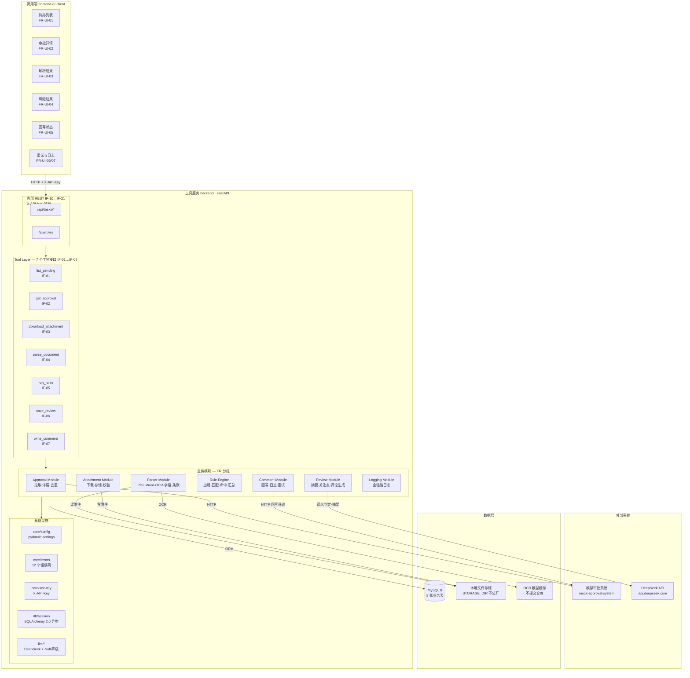

**关键约束（来自 SPEC）**

- `FR-SYS-01`：模拟审批系统**必须**是独立进程，工具服务只能通过 HTTP 访问它。
- `FR-SYS-02`：合同附件**禁止**对外暴露静态路由。
- `FR-SYS-03`：调用端所有请求**必须**带 `X-API-Key`。
- `LM-18`：`E2` 不可用（无 Key / 超时 / 报错）时，系统**必须**仍能跑通全部 AC01–AC19——LLM 是增强项，不是单点依赖。

### FIG-01 ASCII 版

```
┌──────────────────────────────────────────────────────────────────────────┐
│ 调用端  Vue 3 + Element Plus                                              │
│ 待办列表 │ 审批详情 │ 解析结果 │ 风险结果 │ 回写状态 │ 重试/日志           │
└───────────────────────────────┬──────────────────────────────────────────┘
                                │ HTTP + X-API-Key
┌───────────────────────────────▼──────────────────────────────────────────┐
│ 工具服务  FastAPI                                                         │
│                                                                          │
│ Tool Layer   ①拉取 ②详情 ③下载 ④解析 ⑤规则 ⑥存结果 ⑦回写评论             │
│ ──────────────────────────────────────────────────────────────────────── │
│ Approval   待办拉取 · 详情查询 · 任务去重                                 │
│ Attachment 附件下载 · 文件存储 · SHA-256 校验                             │
│ Parser     PDF/Word/OCR · 16 字段提取 · 条款识别 · 证据定位               │
│ RuleEngine 规则加载 · 5 种匹配 · 命中保存 · 风险汇总                      │
│ Review     风险汇总 · 中文摘要 · 审批关注点 · 评论文本                    │
│ Comment    评论生成 · 回写 · 回写日志 · 失败重试                          │
│ Logging    8 类核心操作日志                                              │
│ ──────────────────────────────────────────────────────────────────────── │
│ 基础设施   config(fail-fast) · errors(12 码) · security · db(异步) · llm  │
└──────┬──────────────────┬──────────────────┬─────────────────────────────┘
       │                  │                  │
       │ HTTP             │ ORM              │ OCR / 文件读写
┌──────▼──────────┐ ┌─────▼──────────┐ ┌─────▼──────────────────┐
│ 模拟审批系统     │ │ MySQL 8        │ │ 本地存储               │
│ (独立进程)       │ │ 8 张业务表     │ │ 附件(不公开) + OCR模型  │
└─────────────────┘ └────────────────┘ └────────────────────────┘
                              ▲
                              │ 语义规则判定 + 摘要生成（可降级）
                     ┌────────┴─────────┐
                     │ DeepSeek API     │
                     └──────────────────┘
```

---

## FIG-02 部署架构（进程 / 容器 / 端口）

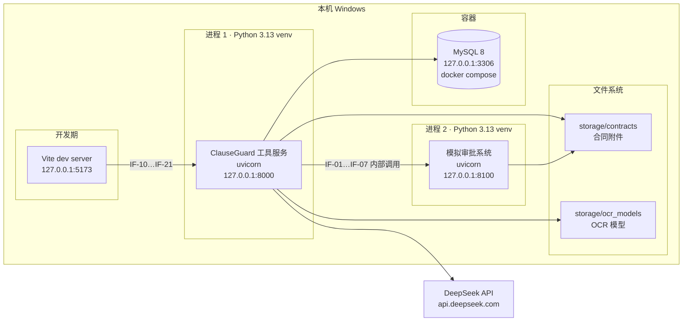

**端口分配（规范）**

| 端口 | 服务 | 说明 |
|---|---|---|
| 8000 | 工具服务 | `APP_PORT`（CF-02） |
| 8100 | 模拟审批系统 | `APPROVAL_BASE_URL`（CF-05） |
| 5173 | Vite 开发服务器 | 仅开发期；生产期前端产物由后端托管 |
| 3306 | MySQL 8 | Docker Compose（CF-04） |

> 工具服务与模拟审批系统**必须**分别启动（`FR-SYS-01`），演示时两个终端各跑一个。

---

## FIG-03 后端模块结构与依赖方向

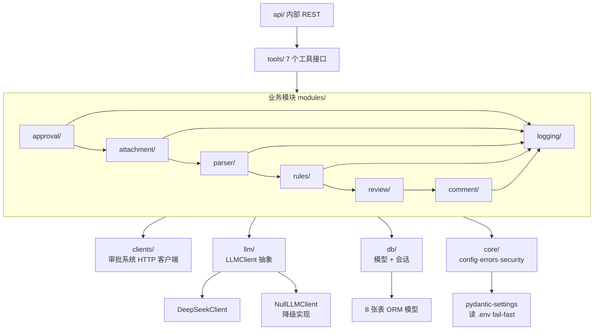

**依赖方向铁律**

- 依赖**只能**自上而下：`api → tools → modules → {clients, llm, db, core}`。
- `logging/` 被所有模块依赖，它**禁止**反向依赖任何业务模块（避免循环）。
- `llm/` 暴露抽象接口，业务模块**只依赖抽象**——这样换端点（DeepSeek → 其他 OpenAI 兼容）不改业务代码。
- 任何模块**禁止**绕过 `db/` 直接用驱动建连接（工程规范 §8）。

---

## FIG-04 端到端业务闭环（9 步 + 数据落点）

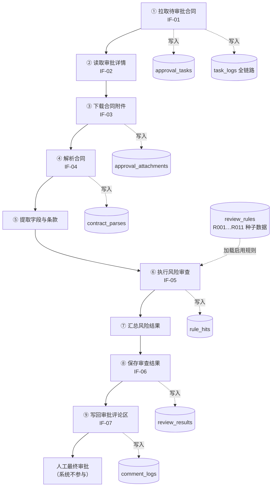

### FIG-04 ASCII 版

```
①拉待办 ──► ②查详情 ──► ③下附件 ──► ④解析 ──► ⑤提字段条款
                                                    │
   approval_tasks   approval_attachments   contract_parses
                                                    │
                                                    ▼
⑨回写评论 ◄── ⑧存结果 ◄── ⑦汇总风险 ◄── ⑥跑规则 ◄────┘
     │             │              │            ▲
     │             │              │            │
comment_logs  review_results  rule_hits   review_rules
     │                                        (R001…R011)
     ▼
人工最终审批（系统只给意见，不做决定）
```

**每一步的强制落点**

| 步骤 | 必须写入的表 | SPEC 依据 |
|---|---|---|
| ① | `approval_tasks` + `task_logs` | FR-APP-01/02、FR-LOG-01 |
| ③ | `approval_attachments` | FR-ATT-02 |
| ④ | `contract_parses`（失败也写 `parse_error`） | FR-PARSE-07 |
| ⑥ | `rule_hits` | FR-RULE-03/07 |
| ⑧ | `review_results` | FR-REV-05 |
| ⑨ | `comment_logs` | FR-COM-03 |

---

## FIG-05 正常链路时序图


**要点**

- LLM 只在**两处**出现：语义规则判定、摘要/关注点生成——图中已标注，其余全部确定性。
- 每次落库前都有一次**证据子串校验**（`PS-10`），校验失败即降级，不写脏证据。

---

## FIG-06 异常与重试时序图（blocked 链路）

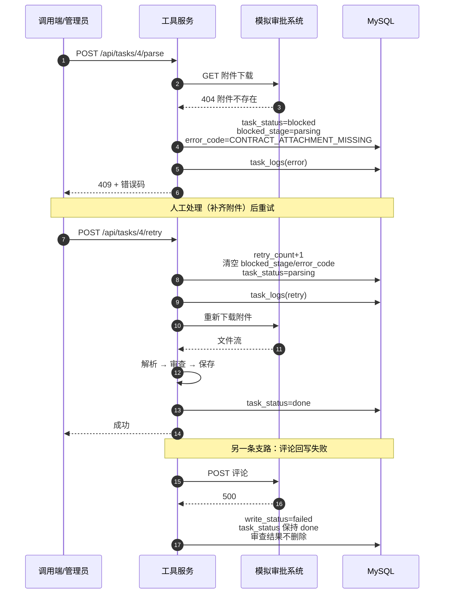

**两条关键规则**

- `ST-01-04` / `FR-COM-04`：**回写失败只改 `write_status`，任务保持 `done`，已产生的审查结果禁止删除**。图中的 Note 就是这个意思。
- `ST-01-02`：重试**必须**清空 `blocked_stage` 与 `error_code` 并把 `retry_count` 加 1。

---

## FIG-07 状态机

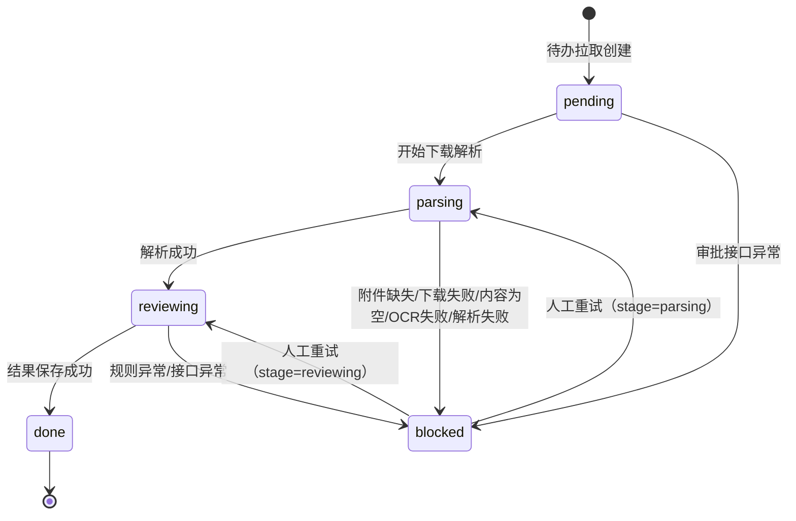

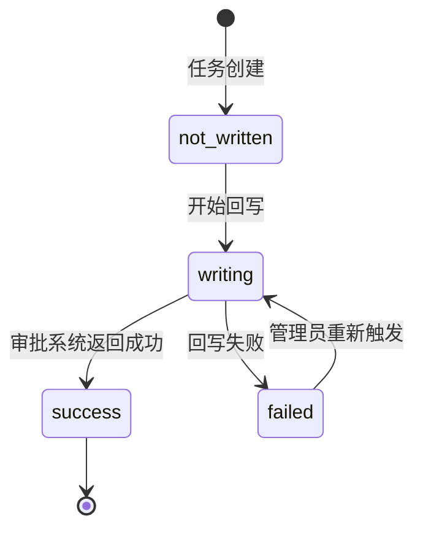

**非法迁移（实现必须拒绝）**

- `done → pending`（`ST-01-03`：重复拉取禁止把已完成任务拉回）
- `blocked → done`（必须经 `parsing`/`reviewing`）
- `success → writing`（`ST-02-01`：重复回写返回既有结果并标 `duplicate=true`）

---

## FIG-08 数据模型 ER 图

```mermaid
erDiagram
    approval_tasks ||--o{ approval_attachments : "1..n"
    approval_tasks ||--o| contract_parses : "1..1"
    approval_tasks ||--o{ rule_hits : "0..n"
    approval_tasks ||--o| review_results : "1..1"
    approval_tasks ||--o{ comment_logs : "0..n"
    approval_tasks ||--o{ task_logs : "0..n"
    review_rules ||--o{ rule_hits : "1..n"

    approval_tasks {
        bigint id PK "即 task_id / case_id"
        varchar instance_id UK "唯一业务标识与去重键"
        varchar approval_code
        varchar approval_title
        varchar applicant_name
        datetime apply_time
        int attachment_count
        varchar task_status "pending/parsing/reviewing/blocked/done"
        varchar write_status "not_written/writing/success/failed"
        varchar blocked_stage "parsing 或 reviewing"
        varchar error_code
        int retry_count
    }
    approval_attachments {
        bigint id PK
        bigint task_id FK
        varchar attachment_code UK "与 task_id 组成唯一索引"
        varchar file_name
        varchar file_type
        varchar file_path "禁止对外暴露"
        bigint file_size
        varchar file_checksum "SHA-256"
        varchar download_status
    }
    contract_parses {
        bigint id PK "即 document_id"
        bigint task_id FK
        bigint attachment_id FK
        json basic_info_json "8 条 FieldRecord"
        json clause_info_json "8 条 FieldRecord"
        longtext full_text "证据校验基准"
        json page_map_json "页码到偏移"
        varchar parse_mode "text 或 ocr"
        varchar parse_status "success/partial/failed"
        text parse_error
    }
    review_rules {
        bigint id PK "即 rule_id"
        varchar rule_code UK "R001…R011"
        varchar rule_name
        varchar risk_level
        varchar rule_status
        varchar match_mode "regex/keyword/threshold/presence/llm_semantic"
        text match_text
        json match_params_json "阈值参数"
        text suggestion_text
        varchar target_section
    }
    rule_hits {
        bigint id PK
        bigint task_id FK
        bigint rule_id FK "与 task_id 组成唯一索引"
        varchar risk_level "命中时快照"
        text evidence_text "必须是合同原文子串"
        varchar evidence_position
        text suggestion_text "命中时快照"
        varchar hit_source "rule 或 llm"
        varchar hit_status "hit/miss/uncertain"
    }
    review_results {
        bigint id PK "即 review_id"
        bigint task_id FK "唯一索引"
        varchar overall_risk_level
        text summary_text
        json focus_points_json
        text comment_text
    }
    comment_logs {
        bigint id PK
        bigint task_id FK
        varchar write_status
        text write_response_text
        varchar remark_id
        varchar idempotency_key UK "instance_id 加 review_id 的 SHA-256"
    }
    task_logs {
        bigint id PK
        bigint task_id FK
        varchar log_level
        varchar log_type "pull/download/parse/ocr/extract/rule/save/write_comment/retry"
        text log_content "已脱敏"
    }
```

### FIG-08 ASCII 版

```
                        ┌──────────────────────┐
                        │   approval_tasks     │
                        │ id (PK) = task_id    │
                        │ instance_id  UNIQUE  │◄── 去重键
                        │ task_status          │
                        │ write_status         │
                        │ blocked_stage/error  │
                        └───────────┬──────────┘
        ┌───────────────┬───────────┼───────────┬───────────────┬────────────┐
        │ 1..n          │ 1..1      │ 0..n      │ 1..1          │ 0..n       │ 0..n
        ▼               ▼           ▼           ▼               ▼            ▼
┌───────────────┐ ┌───────────┐ ┌─────────┐ ┌──────────────┐ ┌──────────┐ ┌─────────┐
│approval_      │ │contract_  │ │rule_hits│ │review_results│ │comment_  │ │task_logs│
│attachments    │ │parses     │ │         │ │              │ │logs      │ │         │
│               │ │           │ │         │ │              │ │          │ │         │
│(task_id,      │ │(task_id,  │ │(task_id,│ │task_id UNIQUE│ │idempot-  │ │8 类日志 │
│ attach_code)  │ │ attach_id)│ │ rule_id)│ │              │ │ency_key  │ │         │
│  UNIQUE       │ │  UNIQUE   │ │ UNIQUE  │ │              │ │ UNIQUE   │ │         │
└───────────────┘ └───────────┘ └────┬────┘ └──────────────┘ └──────────┘ └─────────┘
                                     │ n..1
                                     ▼
                            ┌─────────────────┐
                            │  review_rules   │
                            │ rule_code UNIQUE│
                            │ R001 … R011     │
                            └─────────────────┘
```

**4 个 ⭐ 唯一索引就是 4 道防重复的防线**（见 FIG-11）。

---

## FIG-09 解析流水线（PDF / Word / OCR 分流）

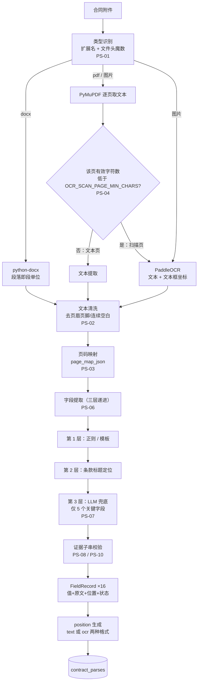

**分流规则**

- 混合文档（部分页扫描）→ `parse_mode` **必须**取 `ocr`（`PS-05`，从严），保证 `position` 格式唯一。
- LLM 兜底**只**作用于 `contract_amount`、`party_a`、`party_b`、`effective_date`、`expiry_date` 五个关键字段（`PS-07`）。
- 任何字段失败**不得**中断整体解析（`FR-PARSE-10`）。

---

## FIG-10 规则引擎结构（11 规则 × 5 模式 + 汇总）

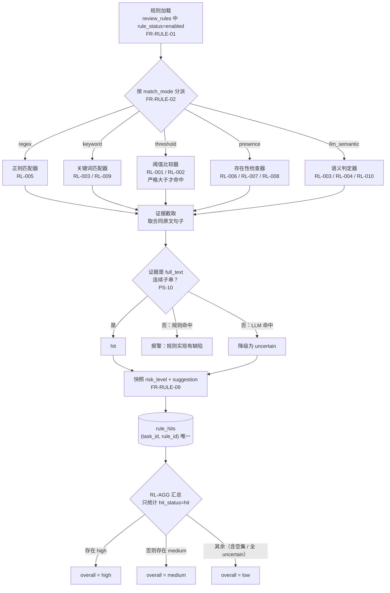

**11 条规则的模式分布**

| 模式 | 规则 | 条数 |
|---|---|---|
| `threshold` | R001 预付款比例、R002 付款周期 | 2 |
| `presence` | R006 主体缺失、R007 金额缺失、R008 保密缺失 | 3 |
| `regex` | R005 管辖地 | 1 |
| `keyword` | R003 自动续约、R009 数据处理 | 2 |
| `presence + llm_semantic` | R004 违约责任、R010 知识产权 | 2 |
| `presence + keyword` | R011 验收标准缺失 | 1 |
| **合计** | | **11** |

> **只有 3 条规则会用到 LLM**（R003/R004/R010），其余 8 条完全确定——这正是"规则为主、LLM 兜底"的落点。

---

## FIG-11 幂等与唯一索引分布（4 道防线）

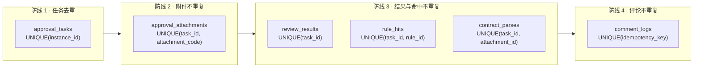

**为什么必须靠数据库约束**（`FR-APP-03`）

应用层"先查后插"在并发下会失效：两个请求同时查到"不存在"，然后都插入。唯一索引是唯一可靠的防线——**重复拉取、重复解析、重复审查、重复回写**四种场景全部由索引兜底，应用层只负责捕获冲突并转为 upsert。

| 场景 | 防线 | SPEC |
|---|---|---|
| 重复拉取同一审批单 | `UNIQUE(instance_id)` | `FR-APP-02/03` |
| 重复下载同一附件 | `UNIQUE(task_id, attachment_code)` | `FR-ATT-06` |
| 重复解析同一附件 | `UNIQUE(task_id, attachment_id)` | `FR-PARSE-09` |
| 重复执行审查 | `UNIQUE(task_id, rule_id)` | `FR-RULE-07` |
| 重复保存结果 | `UNIQUE(task_id)` | `FR-REV-05` |
| 重复回写评论 | `UNIQUE(idempotency_key)` | `FR-COM-02` |

---

## FIG-12 前端结构与接口映射

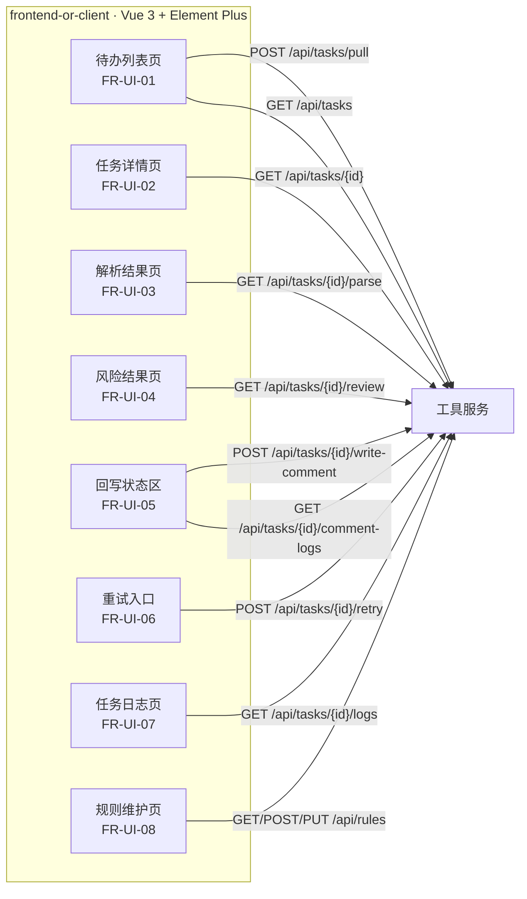

**展示要点（验收时看这些）**

- 风险等级三色区分（`NF-10`）：`high` 红、`medium` 橙、`low` 绿。
- 解析结果的 `missing` / `failed` 字段**必须**视觉区分（`FR-UI-03`）——验收时一眼能看出哪个字段没提到。
- 每个风险项**必须**同时显示证据原文与位置——这是 PRD "可解释性"原则的界面体现。

---

## FIG-13 里程碑依赖关系

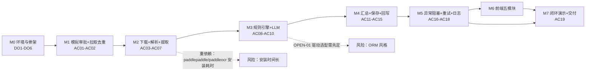

**依赖说明**

- `M2` 是**最长的一步**：要装 paddlepaddle + paddleocr（体积大），还要调优扫描页判定阈值与字段词表。
- `M6` 前端**只依赖 `M5` 的接口**，因此在后端接口稳定后可以与 `M5` 部分并行。
- `OPEN-01`（`asyncmy` vs 同步 `pymysql`）**必须在 M0 定**，否则 `M1` 的 ORM 代码要返工。

---

## 附录：图集与文档索引

| 图 | 主题 | 主要依据 |
|---|---|---|
| FIG-01 | 系统总体架构 | 设计文档 §3、SPEC §4 |
| FIG-02 | 部署架构 | 设计文档 §3.3、SPEC §3 |
| FIG-03 | 后端模块结构 | SPEC §4、工程规范 §3 |
| FIG-04 | 端到端闭环 | PRD §6、SPEC §4 |
| FIG-05 | 正常链路时序 | SPEC §4、§5 |
| FIG-06 | 异常与重试时序 | SPEC §5.4、§7 |
| FIG-07 | 状态机 | SPEC §7（ST-01/ST-02） |
| FIG-08 | 数据模型 ER | SPEC §6（DT-01…DT-08） |
| FIG-09 | 解析流水线 | SPEC §9（PS-01…PS-11） |
| FIG-10 | 规则引擎结构 | SPEC §8（RL-001…RL-AGG） |
| FIG-11 | 幂等与唯一约束 | SPEC §6、§12（NF-02/03） |
| FIG-12 | 前端结构与接口 | SPEC §5.2、§4.8 |
| FIG-13 | 里程碑依赖 | 设计文档 §14、SPEC §13 |
